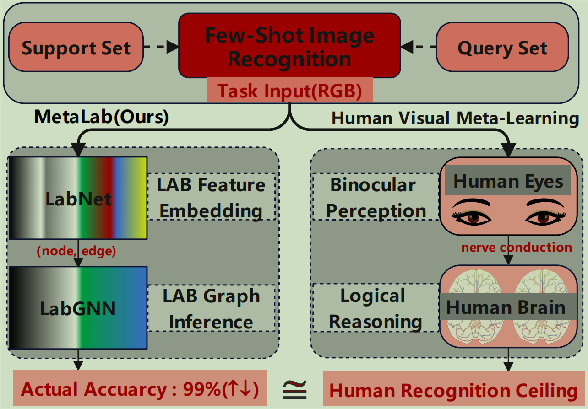
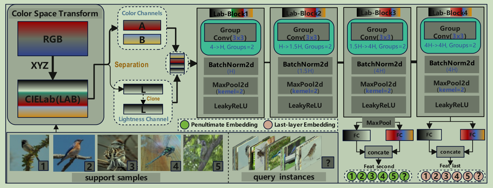
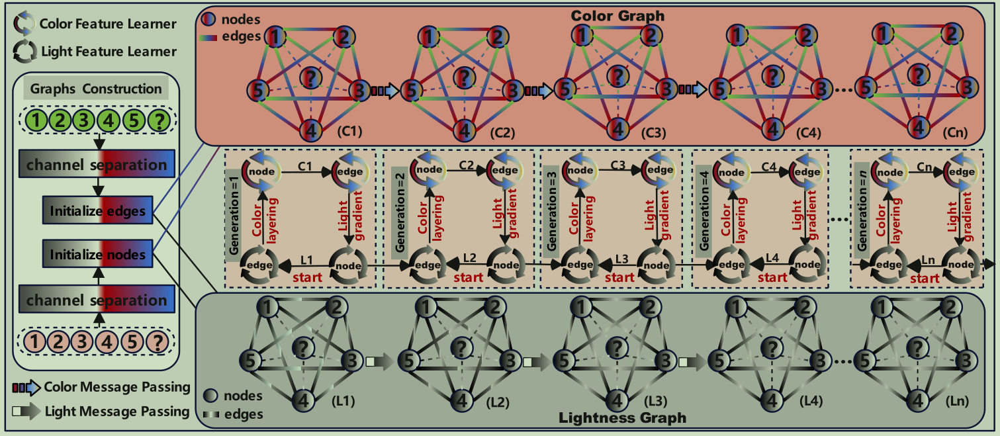
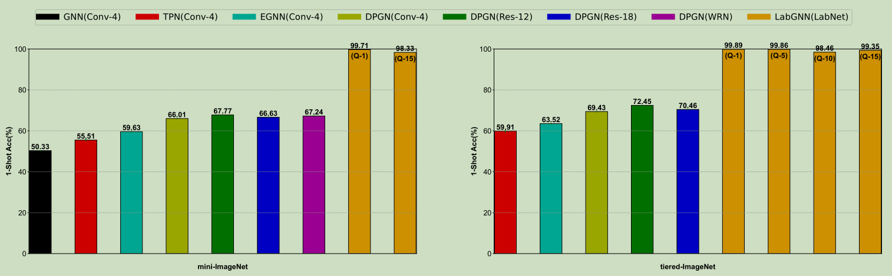

# MetaLab: Few-Shot Game Changer for Image Recognition


This package includes our codes for implementing "MetaLab: Few-Shot Game Changer for Image Recognition". 
(Fully Released Date: 2025-07-30)
Benchmark Link: https://pan.baidu.com/s/1KiIZ0FXkGPnhsq0sXjrsZA Code: cf5w 
Paper: https://arxiv.org/pdf/2507.22057
<p align="center"></p>

## 1.Introduction

*Difficult few-shot image recognition has significant application prospects, yet remaining the substantial technical gaps with the conventional large-scale image recognition.
In this paper, we have proposed an efficient original method for few-shot image recognition, called CIELab-Guided Coherent Meta-Learning (MetaLab). Structurally, our MetaLab comprises two collaborative neural networks: LabNet, which can perform domain transformation for the CIELab color space and extract rich grouped features, and coherent LabGNN, which can facilitate mutual learning between lightness graph and color graph. For sufficient certification, we have implemented extensive comparative studies on four
coarse-grained benchmarks, four fine-grained benchmarks, and four cross-domain few-shot benchmarks. Specifically, our method can achieve high accuracy, robust performance, and effective generalization capability with one-shot sample per class. Overall, all experiments have demonstrated that our MetaLab can approach 99% ↑↓ accuracy, reaching the human recognition ceiling with little visual deviation.*
<div style="display: flex; justify-content: space-between;">
    
    
</div>


## 2.Few-shot Benchmarks Preparation   

```
12 Benchmarks Materials:
├── CIFAR_FS                     ├── FC100                        ├── mini_imagenet                  ├── tieredimagenet_npz
│   ├── CIFAR_FS_train.pickle    │   ├── FC100_train.pickle       │   ├── mini_imagenet_train.pickle │   ├── train_images.npz,train_labels.pkl
│   ├── CIFAR_FS_test.pickle     │   ├── FC100_test.pickle        │   ├── mini_imagenet_test.pickle  │   ├── test_images.npz,test_labels.pkl
│   ├── CIFAR_FS_val.pickle      │   ├── FC100_val.pickle         │   ├── mini_imagenet_val.pickle   │   ├── val_images.npz,val_labels.pkl
├── aircraft_fs                  ├── meta_iNat                    ├── cub_cropped                    ├── tiered_meta_iNat
│   ├── aircraft_fs_train.pickle │   ├── meta_iNat_train.pickle   │   ├── cub_cropped_train.pickle   │   ├── tiered_meta_iNat_train.pickle
│   ├── aircraft_fs_test.pickle  │   ├── meta_iNat_test.pickle    │   ├── cub-cropped_test.pickle    │   ├── tiered_meta_iNat.pickle
│   ├── aircraft_fs_val.pickle   │   ├── meta_iNat_val.pickle     │   ├── cub-cropped_val.pickle     │   ├── tiered_meta_iNat.pickle
├── places                       ├── Stanford_Car                 ├── CropDisease                    ├── EuroSAT
│   ├── places_test.pickle       │   ├── Stanford_Car_test.pickle │   ├── CropDisease_test.pickle    │   ├── EuroSAT_test.pickle
```


## 3.Meta-training, Meta-evaluation and Meta-testing

*Meta-training & -evaluation*: following commands provide an example to train and eval our MetaLab.
```bash
# Usage: python3 ./scripts/metalab_main.py [config config-file] [device index] [mode style] [log-step]
python3 metalab_main.py  --config metalab_config/query_1/metalab_5way_1shot_mini-imagenet.py  --device $GPU --mode train --log_step 5
```

*Meta-testing*: following command provides an example to infer the checkpoint after training.
```bash
# Usage: python3 ./scripts/metalab_main.py [config config-file] [device index] [mode style] [log-step]
python3 metalab_main.py  --config metalab_config/query_1/metalab_5way_1shot_mini-imagenet.py  --device $GPU --mode eval
```

*Cross-Domain Meta-testing*: following command provides an example to infer novel subset with pretrained model.
```bash
# Usage: python3 ./scripts/metalab_main.py [config config-file] [device index] [mode style] [log-step]
python3 metalab_cross_domain.py  --config metalab_config/query_15_cross_domain/metalab_5way_1shot_places.py  --device $GPU --mode eval
```


## 4.Few-shot Recognition Experiments (5w-1s-1q, 5w-1s-5q, 5w-1s-10q, 5w-1s-15q)


### Ⅰ. Coarse-grained Few-shot Recognition
*We have reported the Experimental results on CIFAR-FS, FC100, mini-Imagenet and tiered-imagenet benchmarks in our paper. Here, we take the mini-Imagenet and tiered-imagenet as examples. We conduct the 5,000 randomly sampled episodes experiments, and report average results for 1-shot evaluation. More details on the experiments can be seen in the paper.*
<table>
         <tr>
             <th rowspan="2" style="text-align:center;">MetaLab(Ours)</th>
             <th rowspan="2" style="text-align:center;">Backbone</th>
             <th colspan="3" style="text-align:center;">5-way-1-shot-1-query</th>
             <th colspan="3" style="text-align:center;">5-way-1-shot-5-query</th>
             <th colspan="3" style="text-align:center;">5-way-1-shot-10-query</th>
             <th colspan="3" style="text-align:center;">5-way-1-shot-15-query</th>
         </tr>
         <tr>
             <th colspan="1" style="text-align:center;">Accuracy</th>
             <th colspan="1" style="text-align:center;">Pretrain-Model</th>
             <th colspan="1" style="text-align:center;">Full-Log</th>
             <th colspan="1" style="text-align:center;">Accuracy</th>
             <th colspan="1" style="text-align:center;">Pretrain-Model</th>
             <th colspan="1" style="text-align:center;">Full-Log</th>
             <th colspan="1" style="text-align:center;">Accuracy</th>
             <th colspan="1" style="text-align:center;">Pretrain-Model</th>
             <th colspan="1" style="text-align:center;">Full-Log</th>
             <th colspan="1" style="text-align:center;">Accuracy</th>
             <th colspan="1" style="text-align:center;">Pretrain-Model</th>
             <th colspan="1" style="text-align:center;">Full-Log</th>
         </tr>
         <tr>
             <td style="text-align:center">CIFAR-FS</td>
             <td style="text-align:center">LabNet</td>
             <td style="text-align:center;">99.95±0.01 </td>
             <td style="text-align:center;"><a href="https://drive.google.com/drive/folders/1N2gDu0r-J_MQ-5c2-rY3-9B-KPHP1uD7?usp=drive_link">Download</a></td>
             <td style="text-align:center;"><a href="https://drive.google.com/drive/folders/1AV1Fx5bEfqDQn3R0ieAPzoASfITIkfeD?usp=drive_link">Download</a></td>
             <td style="text-align:center;">98.20±0.04 </td>
             <td style="text-align:center;"><a href="https://drive.google.com/drive/folders/1VEepx3BGirmmZq207h7L14EAxjcQJjdL?usp=drive_link">Download</a></td>
             <td style="text-align:center;"><a href="https://drive.google.com/drive/folders/1FuUngk3b9mRAAm3DLeLS8f8Rmx4Ggjqn?usp=drive_link">Download</a></td>
             <td style="text-align:center;">97.30±0.05 </td>
             <td style="text-align:center;"><a href="https://drive.google.com/drive/folders/1ZUvzxSIjvNoqG2elX72xQ4ARrfM6XD1l?usp=drive_link">Download</a></td>
             <td style="text-align:center;"><a href="https://drive.google.com/drive/folders/15DIMGn9WeYzHYxOfR26BVp_7J_ThT_gx?usp=drive_link">Download</a></td>
             <td style="text-align:center;">99.84±0.02 </td>
             <td style="text-align:center;"><a href="https://drive.google.com/drive/folders/1a0VXIBnfVTIeKzMtPwVBPIdTZbzLHBlp?usp=drive_link">Download</a></td>
             <td style="text-align:center;"><a href="https://drive.google.com/drive/folders/1P3ObHP-rIel7MWq0Y7fkrgVkohckXGMR?usp=drive_link">Download</a></td>
         </tr>
         <tr>
             <td style="text-align:center">FC100</td>
             <td style="text-align:center">LabNet</td>
             <td style="text-align:center;">99.93±0.01 </td>
             <td style="text-align:center;"><a href="https://drive.google.com/drive/folders/1CVaKXpBf4sFIRWS6JTx3Y_O8FhAqcpyK?usp=drive_link">Download</a></td>
             <td style="text-align:center;"><a href="https://drive.google.com/drive/folders/19b92-yk-q8K2DbQuEiDLW_RehSiw0i2H?usp=drive_link">Download</a></td>
             <td style="text-align:center;">98.62±0.03 </td>
             <td style="text-align:center;"><a href="https://drive.google.com/drive/folders/1ZgpBrCiOvGWXI1nLXElOZrdCV4G_E6MG?usp=drive_link">Download</a></td>
             <td style="text-align:center;"><a href="https://drive.google.com/drive/folders/1qgsvQgjuWhBOuktq2SYvUmxNXWwrrcPD?usp=drive_link">Download</a></td>
             <td style="text-align:center;">95.98±0.09 </td>
             <td style="text-align:center;"><a href="https://drive.google.com/drive/folders/1gYRn0GmA0cD4GzkZDQJmE2Iv8c_AQNgx?usp=drive_link">Download</a></td>
             <td style="text-align:center;"><a href="https://drive.google.com/drive/folders/1QALmyKv_m1rq1D4lj5nDGbw54Ha7E2i8?usp=drive_link">Download</a></td>
             <td style="text-align:center;">99.18±0.06 </td>
             <td style="text-align:center;"><a href="https://drive.google.com/drive/folders/15E5Rw-xeqFizAA6l9-tD117YQin36xyd?usp=drive_link">Download</a></td>
             <td style="text-align:center;"><a href="https://drive.google.com/drive/folders/1J-AlLzI5qSYo-YNzfw1ZxANKDZUmzB4X?usp=drive_link">Download</a></td>
         </tr>
         <tr>
             <td style="text-align:center">mini-Imagenet</td>
             <td style="text-align:center">LabNet</td>
             <td style="text-align:center;">99.71±0.02 </td>
             <td style="text-align:center;"><a href="https://drive.google.com/drive/folders/1HJtaGB1BOeaa63CAlzChVbTrIq9fHODW?usp=drive_link">Download</a></td>
             <td style="text-align:center;"><a href="https://drive.google.com/drive/folders/1BdZ3s30gjqAuMPh5leYOGhjLU1J4b--T?usp=drive_link">Download</a></td>
             <td style="text-align:center;">99.24±0.03 </td>
             <td style="text-align:center;"><a href="https://drive.google.com/drive/folders/1m0eArfE3FTvCLvHH-neTWzR5LxGZMtvI?usp=drive_link">Download</a></td>
             <td style="text-align:center;"><a href="https://drive.google.com/drive/folders/1g03ExgEpzb1h3r_H5y8F_QTSdi8znPWp?usp=drive_link">Download</a></td>
             <td style="text-align:center;">97.70±0.04 </td>
             <td style="text-align:center;"><a href="https://drive.google.com/drive/folders/1biqkAFb1a_6kLe9uAUOsMF8RWABuA4Wk?usp=drive_link">Download</a></td>
             <td style="text-align:center;"><a href="https://drive.google.com/drive/folders/1-pHo8y7W5GUNKwTCAp7E1E_vxiQGRZo_?usp=drive_link">Download</a></td>
             <td style="text-align:center;">98.33±0.09 </td>
             <td style="text-align:center;"><a href="https://drive.google.com/drive/folders/1Ex6YC5yQLDkpJiCArDx5wm9HIOVxPzri?usp=drive_link">Download</a></td>
             <td style="text-align:center;"><a href="https://drive.google.com/drive/folders/1tuDMbdnbG6GhQl6b-axe6B4QWyRkq6a_?usp=drive_link">Download</a></td>
         </tr>
         <tr>
             <td style="text-align:center">tiered-Imagenet</td>
             <td style="text-align:center">LabNet</td>
             <td style="text-align:center;">99.89±0.01 </td>
             <td style="text-align:center;"><a href="https://drive.google.com/drive/folders/1tzrJLvn5_OUdp_mephGSAogCY6rEOb2K?usp=drive_link">Download</a></td>
             <td style="text-align:center;"><a href="https://drive.google.com/drive/folders/1VNJuQ1Ms1M5QQgJ8nq0wdjlVj5PT-yA6?usp=drive_link">Download</a></td>
             <td style="text-align:center;">99.86±0.01 </td>
             <td style="text-align:center;"><a href="https://drive.google.com/drive/folders/1YyGZPEb6QfMp1IkdxmPxsy1AWBYX6gIN?usp=drive_link">Download</a></td>
             <td style="text-align:center;"><a href="https://drive.google.com/drive/folders/1HPzd43um8Xm44-gnSEXkKdHYyyfiREK7?usp=drive_link">Download</a></td>
             <td style="text-align:center;">98.46±0.04 </td>
             <td style="text-align:center;"><a href="https://drive.google.com/drive/folders/1e_MUwnUG96IfHDRFgps268NOll63WHKl?usp=drive_link">Download</a></td>
             <td style="text-align:center;"><a href="https://drive.google.com/drive/folders/1uNxA6g9hAgu0DFTXLsegESGMiZRONpJx?usp=drive_link">Download</a></td>
             <td style="text-align:center;">99.35±0.05 </td>
             <td style="text-align:center;"><a href="https://drive.google.com/drive/folders/1c4mk0bGKLDFtT3Hv1lh1_G4CBOqN1lUy?usp=drive_link">Download</a></td>
             <td style="text-align:center;"><a href="https://drive.google.com/drive/folders/1DNDwCfs0vq3LLKfdUPZ7cwTRciSd-GfO?usp=drive_link">Download</a></td>
         </tr>
</table>


### Ⅱ. Fine-grained Few-shot Recognition
*We report the Experimental results on CUB-200-2011, Aircraft-FS, meta-iNat and tiered-meta-iNat benchmarks. We conduct the 5,000 randomly sampled episodes experiments, and report average results for 1-shot evaluation. More details on the experiments can be seen in the paper.*
<table>
         <tr>
             <th rowspan="2" style="text-align:center;">MetaLab(Ours)</th>
             <th rowspan="2" style="text-align:center;">Backbone</th>
             <th colspan="3" style="text-align:center;">5-way-1-shot-1-query</th>
             <th colspan="3" style="text-align:center;">5-way-1-shot-5-query</th>
             <th colspan="3" style="text-align:center;">5-way-1-shot-10-query</th>
             <th colspan="3" style="text-align:center;">5-way-1-shot-15-query</th>
         </tr>
         <tr>
             <th colspan="1" style="text-align:center;">Accuracy</th>
             <th colspan="1" style="text-align:center;">Pretrain-Model</th>
             <th colspan="1" style="text-align:center;">Full-Log</th>
             <th colspan="1" style="text-align:center;">Accuracy</th>
             <th colspan="1" style="text-align:center;">Pretrain-Model</th>
             <th colspan="1" style="text-align:center;">Full-Log</th>
             <th colspan="1" style="text-align:center;">Accuracy</th>
             <th colspan="1" style="text-align:center;">Pretrain-Model</th>
             <th colspan="1" style="text-align:center;">Full-Log</th>
             <th colspan="1" style="text-align:center;">Accuracy</th>
             <th colspan="1" style="text-align:center;">Pretrain-Model</th>
             <th colspan="1" style="text-align:center;">Full-Log</th>
         </tr>
         <tr>
             <td style="text-align:center">CUB-200-2011</td>
             <td style="text-align:center">LabNet</td>
             <td style="text-align:center;">99.57±0.03 </td>
             <td style="text-align:center;"><a href="https://drive.google.com/drive/folders/1lXJu-cZilWITe-XOCiZk3kgw_R7ZvgK5?usp=drive_link">Download</a></td>
             <td style="text-align:center;"><a href="https://drive.google.com/drive/folders/1u0zX5xJW-JrRTsIlRP3UzAzQqI3q-y1z?usp=drive_link">Download</a></td>
             <td style="text-align:center;">99.38±0.02 </td>
             <td style="text-align:center;"><a href="https://drive.google.com/drive/folders/1wHuwfE3e_sVgvWgZCLEe0PbzR6LkDxdX?usp=drive_link">Download</a></td>
             <td style="text-align:center;"><a href="https://drive.google.com/drive/folders/1Idtnwp6QtyCxyJ21ilHHJKNA4J1sYtkk?usp=drive_link">Download</a></td>
             <td style="text-align:center;">95.92±0.06 </td>
             <td style="text-align:center;"><a href="https://drive.google.com/drive/folders/11-sNFmXIswWOxZaavAfOzfgM_iTwnFWw?usp=drive_link">Download</a></td>
             <td style="text-align:center;"><a href="https://drive.google.com/drive/folders/1aEZ5IMoSr_ZCzAZSfUNESxS9r80-iM0p?usp=drive_link">Download</a></td>
             <td style="text-align:center;">98.28±0.07 </td>
             <td style="text-align:center;"><a href="https://drive.google.com/drive/folders/1ixQ-dyvH-FvuCtN3PHxiBv4ph23HCRK3?usp=drive_link">Download</a></td>
             <td style="text-align:center;"><a href="https://drive.google.com/drive/folders/1bC7Dv86cNA9QBJs0J16xL3ExXwjq52V4?usp=drive_link">Download</a></td>
         </tr>
         <tr>
             <td style="text-align:center">Aircraft-FS</td>
             <td style="text-align:center">LabNet</td>
             <td style="text-align:center;">99.96±0.01 </td>
             <td style="text-align:center;"><a href="https://drive.google.com/drive/folders/1G2GZHHomIX-dlVyR10YWO-j43QmJpF0T?usp=drive_link">Download</a></td>
             <td style="text-align:center;"><a href="https://drive.google.com/drive/folders/1tggcg_4Eh3LJWN64FigtaWD4rbUyATmg?usp=drive_link">Download</a></td>
             <td style="text-align:center;">98.98±0.03 </td>
             <td style="text-align:center;"><a href="https://drive.google.com/drive/folders/1s5m-7F7uUNOKVRoLHOWHIIteUFSl2zZ0?usp=drive_link">Download</a></td>
             <td style="text-align:center;"><a href="https://drive.google.com/drive/folders/1s5m-7F7uUNOKVRoLHOWHIIteUFSl2zZ0?usp=drive_link">Download</a></td>
             <td style="text-align:center;">97.85±0.04 </td>
             <td style="text-align:center;"><a href="https://drive.google.com/drive/folders/1SkJtVK0sbpXRvjnTeDWQijYRd8-WnpJv?usp=drive_link">Download</a></td>
             <td style="text-align:center;"><a href="https://drive.google.com/drive/folders/1EvqvK4WPlcfnzvxTeaFsVB11DE37SnK8?usp=drive_link">Download</a></td>
             <td style="text-align:center;">99.33±0.04 </td>
             <td style="text-align:center;"><a href="https://drive.google.com/drive/folders/1M_xDYmv7l4JUdBatu0lPk6G4u_Wk_2M1?usp=drive_link">Download</a></td>
             <td style="text-align:center;"><a href="https://drive.google.com/drive/folders/1k9r4jS9x65xqtuSMXd56omCnJg3b6zaX?usp=drive_link">Download</a></td>
         </tr>
         <tr>
             <td style="text-align:center">meta-iNat</td>
             <td style="text-align:center">LabNet</td>
             <td style="text-align:center;">99.69±0.02 </td>
             <td style="text-align:center;"><a href="https://drive.google.com/drive/folders/1k_waddPl2Fioro7hfQd9k-d2lBIiRwYq?usp=drive_link">Download</a></td>
             <td style="text-align:center;"><a href="https://drive.google.com/drive/folders/1n-j_tghgciP05MYDUJu471lBsGntWcSD?usp=drive_link">Download</a></td>
             <td style="text-align:center;">99.30±0.02 </td>
             <td style="text-align:center;"><a href="https://drive.google.com/drive/folders/1cFal-H3-hE9xEOzN2Wg-pRZ91B8YXO8J?usp=drive_link">Download</a></td>
             <td style="text-align:center;"><a href="https://drive.google.com/drive/folders/1vhPyKJLEITEDJOXWMvdOeOKYp5xWmCIt?usp=drive_link">Download</a></td>
             <td style="text-align:center;">99.45±0.02 </td>
             <td style="text-align:center;"><a href="https://drive.google.com/drive/folders/176tLiMx-6Gb3TqCOhbqXPGyC_28t7Rj8?usp=drive_link">Download</a></td>
             <td style="text-align:center;"><a href="https://drive.google.com/drive/folders/1f7WveTH8-dk07ANNLGXeh2JXbeBu6_kr?usp=drive_link">Download</a></td>
             <td style="text-align:center;">99.34±0.05 </td>
             <td style="text-align:center;"><a href="https://drive.google.com/drive/folders/1SlQccrddVNjS0B7o4uptGOaNveVHIurI?usp=drive_link">Download</a></td>
             <td style="text-align:center;"><a href="https://drive.google.com/drive/folders/1cGKbKQ_L69_iJ9K0u4t4F4xI-YDbZEpV?usp=drive_link">Download</a></td>
         </tr>
         <tr>
             <td style="text-align:center">tiered-meta-iNat</td>
             <td style="text-align:center">LabNet</td>
             <td style="text-align:center;">99.97±0.01 </td>
             <td style="text-align:center;"><a href="https://drive.google.com/drive/folders/1A73motvQoFiDxUhCwjjw5RbwEwgVobfL?usp=drive_link">Download</a></td>
             <td style="text-align:center;"><a href="https://drive.google.com/drive/folders/1AxGnxorqzBqYugC-ZYqOFC2xvoK3MPf6?usp=drive_link">Download</a></td>
             <td style="text-align:center;">98.19±0.04 </td>
             <td style="text-align:center;"><a href="https://drive.google.com/drive/folders/1DZyWzSX88h4iPyRjLcyovLkJBNL5IR0u?usp=drive_link">Download</a></td>
             <td style="text-align:center;"><a href="https://drive.google.com/drive/folders/1_4NjMNZQa3wCbAxWYKIQfvzX8w6-ipqz?usp=drive_link">Download</a></td>
             <td style="text-align:center;">98.14±0.04 </td>
             <td style="text-align:center;"><a href="https://drive.google.com/drive/folders/1mrjsX59_3f_8OOsDmA6yyNJPik00GFug?usp=drive_link">Download</a></td>
             <td style="text-align:center;"><a href="https://drive.google.com/drive/folders/1WlO3gSAPFIlpuhKVEIzuEmi3JyKCm61t?usp=drive_link">Download</a></td>
             <td style="text-align:center;">99.82±0.03 </td>
             <td style="text-align:center;"><a href="https://drive.google.com/drive/folders/1frOQQYFG-cnPWWRCycXql2ZmjPNaaHcG?usp=drive_link">Download</a></td>
             <td style="text-align:center;"><a href="https://drive.google.com/drive/folders/1Leqok9CzwE-UIzfzIAr7h1LejBgzjKnp?usp=drive_link">Download</a></td>
         </tr>
</table>


### Ⅲ. Cross-Domain Few-shot Recognition (5w-1s-15q)
*We report the Experimental results on Places365, Stanford-Car, CropDisease and EuroSAT benchmarks. We conduct the 5,000 randomly sampled episodes experiments, and report average results for 1-shot evaluation. More details on the experiments can be seen in the paper.*
<table>
         <tr>
             <th rowspan="2" style="text-align:center;">FSL Method</th>
             <th rowspan="2" style="text-align:center;">Backbone</th>
             <th colspan="3" style="text-align:center;">Places365 (Q-15)</th>
             <th colspan="3" style="text-align:center;">Stanford-Car (Q-15)</th>
             <th colspan="3" style="text-align:center;">CropDisease (Q-15)</th>
             <th colspan="3" style="text-align:center;">EuroSAT (Q-15)</th>
         </tr>
         <tr>
             <th colspan="1" style="text-align:center;">Accuracy</th>
             <th colspan="1" style="text-align:center;">Pretrain-Model</th>
             <th colspan="1" style="text-align:center;">Full-Log</th>
             <th colspan="1" style="text-align:center;">Accuracy</th>
             <th colspan="1" style="text-align:center;">Pretrain-Model</th>
             <th colspan="1" style="text-align:center;">Full-Log</th>
             <th colspan="1" style="text-align:center;">Accuracy</th>
             <th colspan="1" style="text-align:center;">Pretrain-Model</th>
             <th colspan="1" style="text-align:center;">Full-Log</th>
             <th colspan="1" style="text-align:center;">Accuracy</th>
             <th colspan="1" style="text-align:center;">Pretrain-Model</th>
             <th colspan="1" style="text-align:center;">Full-Log</th>
         </tr>
         <tr>
             <td style="text-align:center">MetaLab(ours)</td>
             <td style="text-align:center">LabNet</td>
             <td style="text-align:center;">98.44±0.09 </td>
             <td style="text-align:center;"><a href="https://drive.google.com/drive/folders/19iIBbyg3vtI05y0CdLaFXyjtPUTt1mVd?usp=drive_link">Download</a></td>
             <td style="text-align:center;"><a href="https://drive.google.com/drive/folders/1wef-BInWAk3emUiMh9wD-oFgqOTlZ_uJ?usp=drive_link">Download</a></td>
             <td style="text-align:center;">97.73±0.12 </td>
             <td style="text-align:center;"><a href="https://drive.google.com/drive/folders/1WmhPCXHZu_Ij6pKrf8H1UhHM4liGdVeU?usp=drive_link">Download</a></td>
             <td style="text-align:center;"><a href="https://drive.google.com/drive/folders/1F3xyyjBrS18gYSlodanMBVK_-jz0YknL?usp=drive_link">Download</a></td>
             <td style="text-align:center;">99.08±0.06 </td>
             <td style="text-align:center;"><a href="https://drive.google.com/drive/folders/1BJgKCGrt-fm00XUDhel4lClCSCRvqom4?usp=drive_link">Download</a></td>
             <td style="text-align:center;"><a href="https://drive.google.com/drive/folders/1nkA7XPNslGP7AP5IaXoyS-E_Pt_BguDr?usp=drive_link">Download</a></td>
             <td style="text-align:center;">96.94±0.10 </td>
             <td style="text-align:center;"><a href="https://drive.google.com/drive/folders/1OrZcqrMy9Hgs_l9RR3cyHuxXKYVXEj6F?usp=drive_link">Download</a></td>
             <td style="text-align:center;"><a href="https://drive.google.com/drive/folders/1PxeniTVz3UFbWPBo6cScUPlO6Qhjruvm?usp=drive_link">Download</a></td>
         </tr>
</table>


## 5.Comparison with Other Homogeneous Methods
*We conduct the comparison experiments of Our LabGNN with Other Graph Classification Models on the mini-ImageNet and tiered-ImageNet Datasets. We
select GNN, TPN, EGNN, and DPGN for comparison. Our LabGNN can achieve substantially higher accuracy with different Queries, approaching the human recognition ceiling.*
<p align="center"></p>


## License
- Our code refers the the corresponding code publicly available: [FSL](https://github.com/yaoyao-liu/few-shot-classification-leaderboard), [CDFSL](https://github.com/IBM/cdfsl-benchmark?tab=readme-ov-file), [DPGN](https://github.com/megvii-research/DPGN)
- This repository is released under the MIT License. License can be found in [LICENSE](LICENSE) file.
